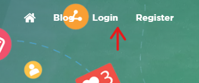
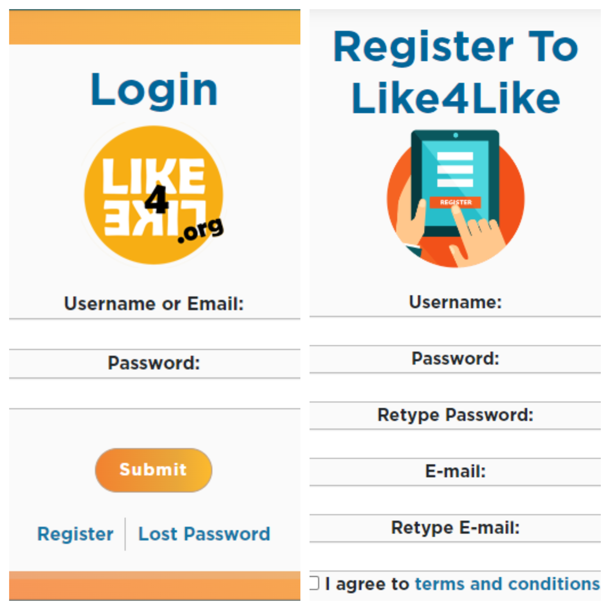

# **Creating a Like4Like account**

To use this script you will need a [Like4Like](https://www.like4like.org/) account, follow the tutorial to create your account.

***Step 1***: Go to [https://www.like4like.org/](https://www.like4like.org/) and click Login in the upper right corner.



***Step 2***: Login if you already have one or click **Register** if you don't.



# **Setting up your account**

***Step 1***: Go to add/Manage pages.

***Step 2***: in **"Select feature"** Select which network you want to earn and what you will earn.

### **The site supports the following social networks:** 


and custom websites

***Step 3***: Select the speed the followers will come from 2 to 10 but remember that this will consume more **credit points**, and where your followers are from by default is everyone.

Ready we finished the site settings now we need to configure the local project

# **Configuring the local project**

Now we need to configure the local project so we can have our very desirable followers, so let's go!

**Open your terminal and navigate to the location you want to add the project and run the following code:**

### `git clone https://github.com/yudur/Followers-bot.git`

**Make sure you are in the Followers-bot directory and run:**

### `python -m venv venv`

### `venv\Scripts\activate`

### `pip install -r requirements.txt`

**after that create a file in the root of the project with the name *".env"* and set the following variables:**

```
EMAIL_LIKE4LIKE="email from your like4like account"
PASSWORD_LIKE4LIKE="your like4like account password"

EMAIL_TWITTER="your twitter email"
PASSWORD_TWITTER="your twitter password"
USERNAME_TWITTER="your twitter username"
```

twitter information will be needed to get **"Free credits"** on the platform, you can pass a fictitious account that will work the same way.

### Now just execute

### `python main.py`
</br>

created by **Yudi Duarte**.